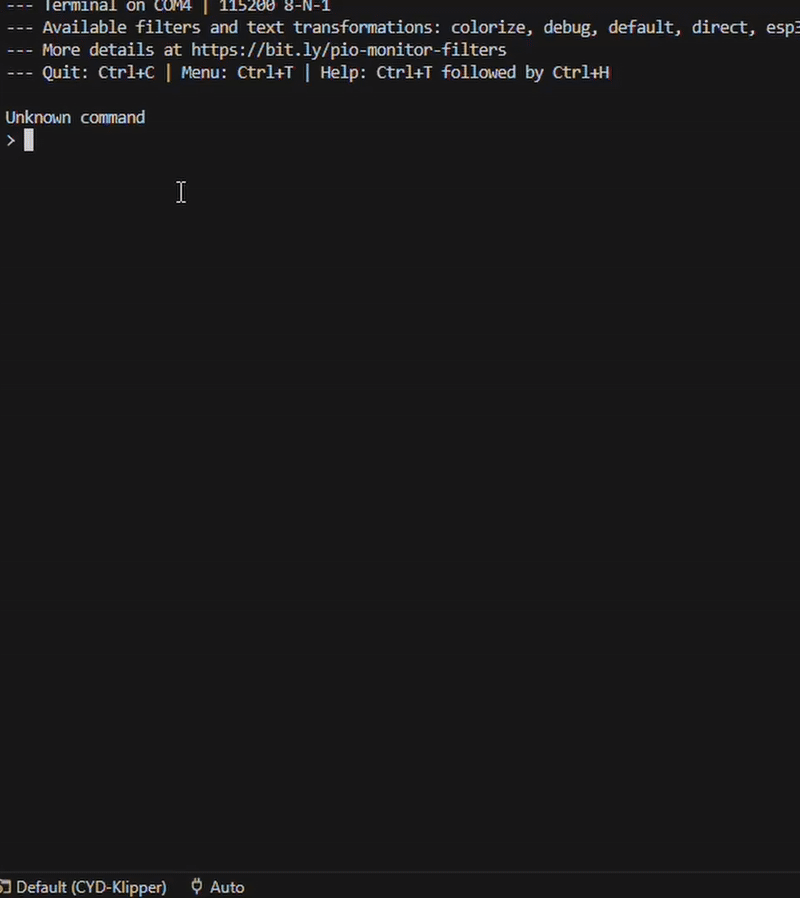

# serial_terminal
A terminal for micro-controllers.

[Watch On Youtube ](https://youtu.be/DpFmoua0rZ8?si=selNsn8JtBRXRExw) \\
[Read blog Hackster.io](https://www.hackster.io/Madrajib/a-command-prompt-for-your-microcontroller-da8cf1)

## DEMO


### Directory structure:
```bash

└── madrajib-serial_terminal/
    ├── README.md
    ├── LICENSE
    ├── linux_main.c              -> use to run in linux shell
    ├── main.cpp                  -> use to run in Arduino/ESP32
    ├── rasspberry_pico_main.c    -> use to run in raspbery pi pico
    └── serial_prompt.h           -> main library
```
## Usage
Include **serial_prompt.h** header file in your project to use it.

* Step 1
  Replace with the serial print/write function, here I have taken
  example for Arduino framework.
  ```c
  #define PRINT  Serial.print
  #define READ  Serial.read
  ```
* Step 2
  Include the header
  ```c
  #define PRINT  Serial.print
  #define READ  Serial.read
  #include "serial_prompt.h"
  ```
* Step 3
  Add your cmd handlers,
  Note: command handler should has
  **int <handle_name>(int argc, char **argv)** definations.
  ```c
  int sample(int argc, char **argv)
  {
      Serial.println("This is sample cmd");
      return 0;
  }
  ```
* Step 4
  Add command nam, description and its handler to commands array
  ```c
  COMMANDS(
    {"sample", "sample func", sample}
  );
  ```
* Step 5
  Call it periodically
  ```c
  void loop() {
    serial_run();
  }
  ```
* Step 6 Flash the firmware to the device, you should see following ouput
  ```bash
  Hello from Serial Prompt
  Type '?' for help
  >
  ```
  If you type "?" you should see the list of cmd available
  ```bash
  > ?
  sample : sample cmd description
  ```
## Examples
* With more than once commands
```bash
Hello from Serial Prompt
Type '?' for help
> ?
print : print func
sample : sample func
> sample
Sample handler called
> print
print handler called
>
```
* with cmd taking args
```c
int multiply_handler(int argc, char **argv) {
  if (argc < 3) {
    Serial.println("mult num1 num2\n");
    return 0;
  }

  int num1 = atoi(argv[1]);
  int num2 = atoi(argv[2]);

  Serial.println(num1 * num2);
  return 0;
}

COMMANDS(
  {"sample", "sample func", sample},
  {"mult", "mult num1 num2", multiply_handler}
);

```
```bash
Hello from Serial Prompt
Type '?' for help
> ?
print : print func
mult : mult num1 num2
> mult 3 4
12
> mult 12 46
552
>

```
### Features
 1. Handles backspace
 2. Handles delete 
 3. Handles backspace/delete with combination with left and right arrow keys.

Contriubted the above features 2 & 3 to [CYD-Klipper firmware](https://github.com/suchmememanyskill/CYD-Klipper)
  >  [serial_console: Add support to handle delete/arrow keys by @MadRajib in #195](https://github.com/suchmememanyskill/CYD-Klipper/pull/195)